# 🌐 Ayush Portfolio

<p align="center">

Modern Full Stack Developer Portfolio built using **React**, **TypeScript**, **Tailwind CSS**, **Framer Motion**, and **Vite**.

</p>

<p align="center">

<a href="https://ayush-portfolio-3yan.onrender.com">

</a>

<a href="https://github.com/AyushKumar-12345">

</a>


</p>

---

# 🌐 Live Demo

### Portfolio Website

https://ayush-portfolio-3yan.onrender.com

---

# 📖 Project Overview

This repository contains my personal developer portfolio showcasing my journey as a **Full Stack MERN Developer**, **Java DSA enthusiast**, and **Machine Learning learner**.

The portfolio highlights my projects, technical skills, education, achievements, coding profiles, and contact information through a modern, responsive, and interactive interface.

Built using **React**, **TypeScript**, **Tailwind CSS**, and **Framer Motion**, the application focuses on performance, accessibility, clean UI/UX, and recruiter-friendly presentation.

---

# ✨ Key Highlights

- Modern responsive interface
- Smooth Framer Motion animations
- Light & Dark theme
- Interactive project showcase
- Skills visualization
- Education timeline
- Achievements section
- Coding profiles
- Contact section
- Resume integration
- SEO optimized

---
# ✨ Features

## 🎨 User Experience

- Modern developer portfolio
- Fully responsive design
- Smooth scrolling navigation
- Beautiful page animations
- Light & Dark mode
- Professional UI/UX
- Fast loading performance

---

## 📂 Portfolio Sections

- Hero Section
- About Me
- Education
- Technical Skills
- Featured Projects
- Achievements
- Coding Profiles
- Services
- Contact

---

## ⚙️ Developer Features

- Resume Download
- Live Project Links
- GitHub Repository Links
- SEO Friendly
- Reusable Components
- Clean Folder Structure
- Type-safe Development

---

# 🛠 Tech Stack

## Frontend

- React 19
- TypeScript
- Vite
- Tailwind CSS
- Framer Motion

---

## UI Libraries

- Lucide React
- React Helmet Async

---

## Development Tools

- Git
- GitHub
- npm
- ESLint
- PostCSS
- VS Code

---

# 📁 Project Structure

```text
portfolio/
│
├── public/
├── src/
│   ├── assets/
│   ├── components/
│   ├── hooks/
│   ├── sections/
│   ├── utils/
│   ├── App.tsx
│   └── main.tsx
│
├── package.json
├── vite.config.ts
└── README.md
```

---

# 🎯 Design Goals

- Professional recruiter-friendly interface
- Smooth user interactions
- Clean component architecture
- Modern UI design
- Accessibility focused
- Optimized performance
- Fully responsive across devices

---
# 📸 Application Preview

## 🏠 Home

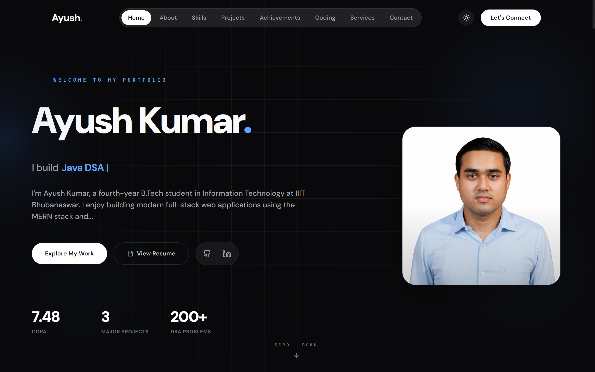

---

## 👨‍💻 About Me

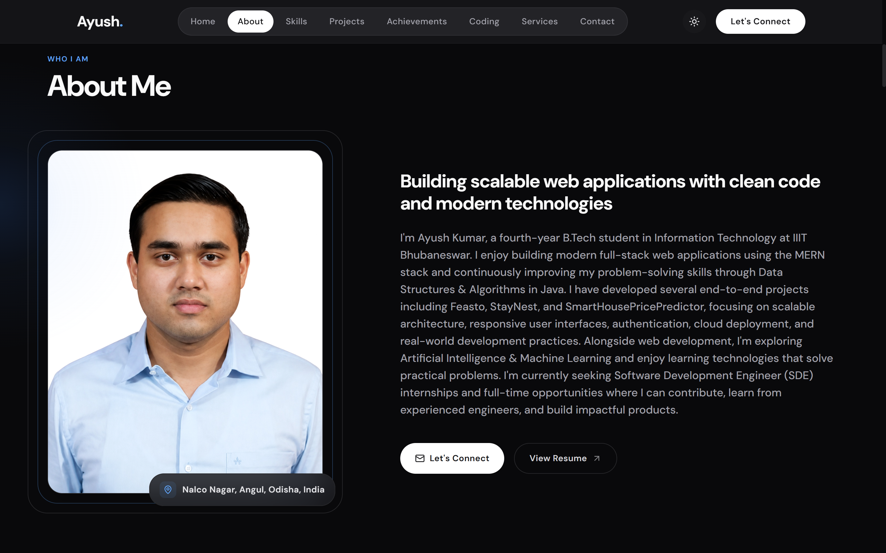

---

## 🎓 Education

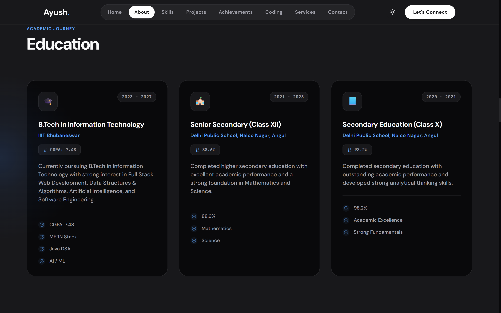

---

## 🛠️ Technical Skills

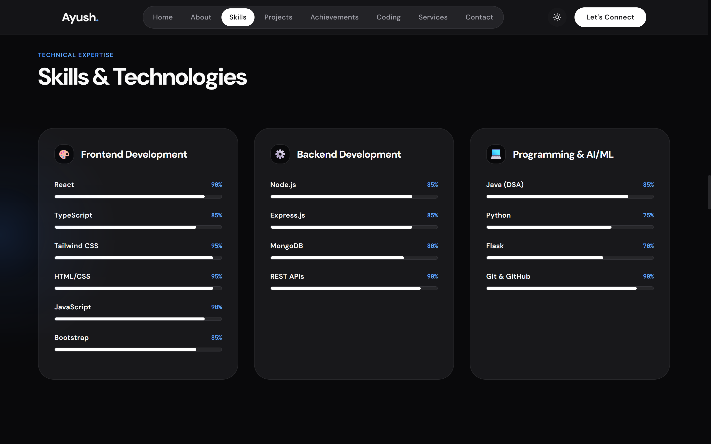

---

## 🚀 Featured Projects

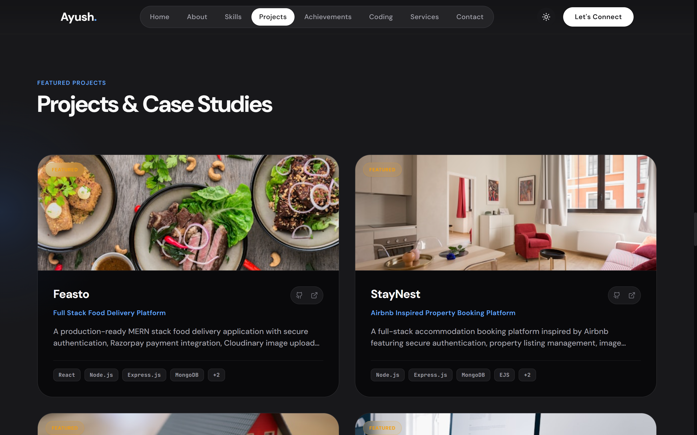

---

## 🚀 More Projects

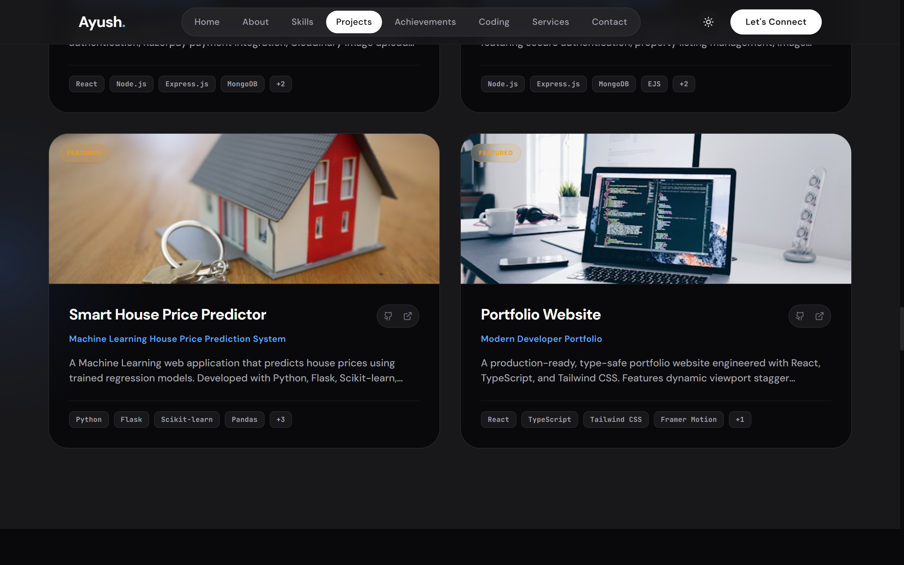

---

## 🏆 Achievements

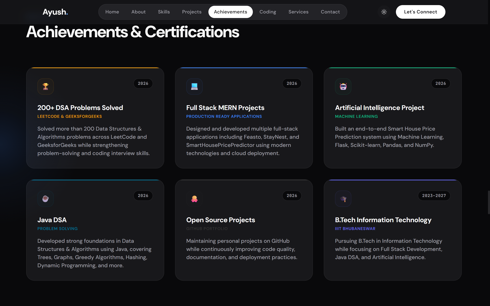

---

## 💻 Coding Profiles

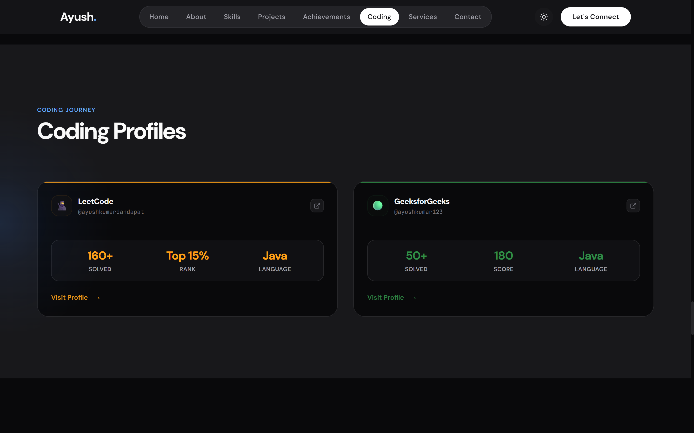

---

## 💼 Services

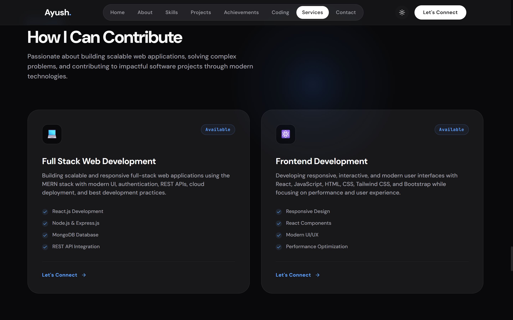

---

## 💼 More Services

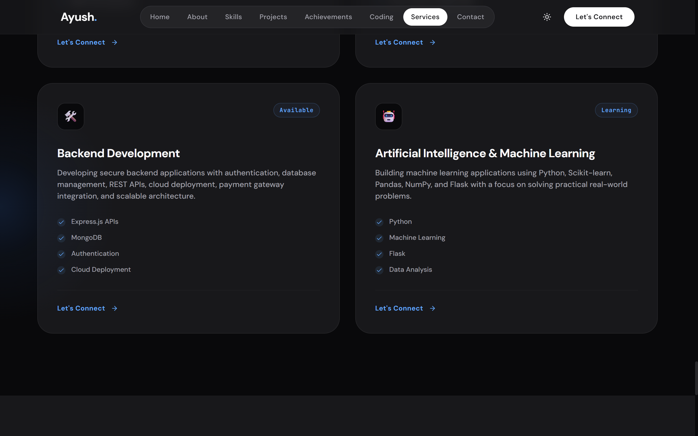

---

## 📬 Contact

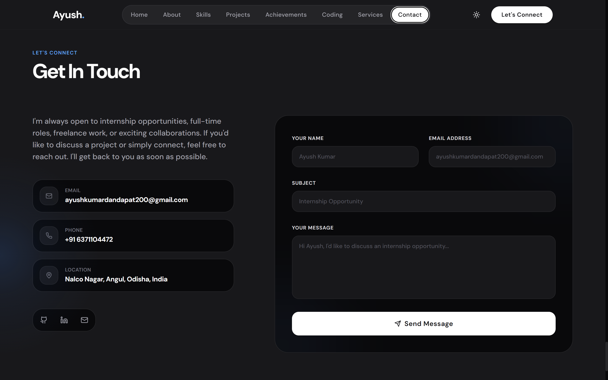

---
# ⚙️ Installation

## 1️⃣ Clone the Repository

```bash
git clone https://github.com/AyushKumar-12345/ayush-portfolio.git
```

Move into the project folder.

```bash
cd ayush-portfolio
```

---

## 2️⃣ Install Dependencies

```bash
npm install
```

---

## 3️⃣ Run the Development Server

```bash
npm run dev
```

---

## 4️⃣ Build for Production

```bash
npm run build
```

---

## 5️⃣ Preview Production Build

```bash
npm run preview
```

---

# 📁 Folder Structure

```text
portfolio/
│
├── public/
├── assets/
│   └── screenshots/
├── src/
│   ├── assets/
│   ├── components/
│   ├── hooks/
│   ├── sections/
│   ├── utils/
│   ├── App.tsx
│   └── main.tsx
│
├── package.json
├── vite.config.ts
├── tsconfig.json
└── README.md
```

---

# 🚀 Performance

- ⚡ Optimized with Vite
- 🎨 Utility-first styling with Tailwind CSS
- 📱 Fully responsive across devices
- ♿ Accessibility-focused design
- ✨ Smooth animations powered by Framer Motion
- 🚀 Optimized production build

---

# 👨‍💻 About the Developer

## Ayush Kumar

**B.Tech Information Technology**  
**IIIT Bhubaneswar**

I enjoy building modern full-stack web applications, solving Data Structures & Algorithms in Java, and exploring Machine Learning through practical projects.

---

# 📫 Connect With Me

- **Email:** ayushkumardandapat200@gmail.com
- **LinkedIn:** https://www.linkedin.com/in/ayush-kumar-97326636a/
- **GitHub:** https://github.com/AyushKumar-12345
- **Portfolio:** https://ayush-portfolio-3yan.onrender.com

---

# 📄 License

This project is developed for **educational and portfolio purposes**.

---

# ⭐ Support

If you found this project helpful, consider giving it a **⭐ Star** on GitHub.

Your support is appreciated.

---

<div align="center">

## 🚀 Built with React, TypeScript, Tailwind CSS & Framer Motion

Thank you for visiting this repository!

</div>